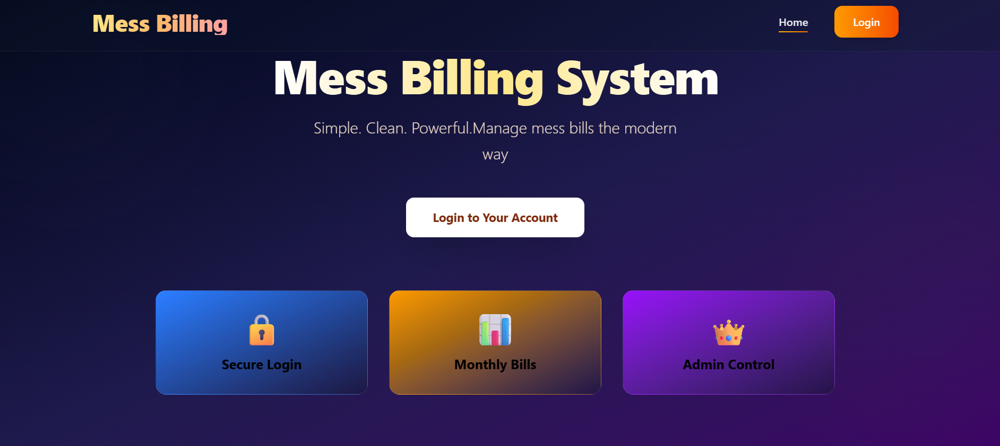
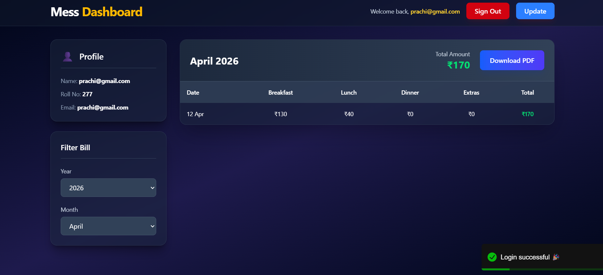
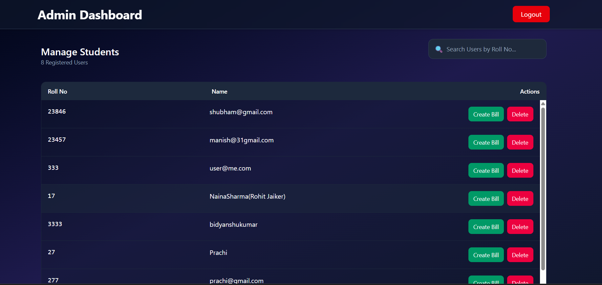
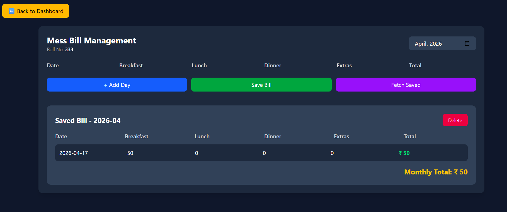

🍽️ Mess Billing System
Smart, Transparent & Automated Meal Management

A modern solution to simplify and automate mess billing operations. This system eliminates manual calculations, reduces errors, and provides a seamless way to track meals and generate accurate bills for users.

🌟 Overview

Managing mess bills manually is time-consuming and prone to mistakes. The Mess Billing System is designed to digitize this process by tracking daily meal consumption and generating precise monthly bills with minimal effort.

Whether it's a hostel, PG, or college mess, this system ensures efficiency, transparency, and reliability.

✨ Key Features
🧾 Automated Billing System – Calculates monthly bills instantly
📅 Daily Meal Logging – Track Breakfast, Lunch, and Dinner
👥 User Management – Maintain individual user records
📊 Monthly Reports – Detailed breakdown of meal consumption
💡 Error-Free Calculations – Eliminates manual mistakes
⚡ Fast & Intuitive Interface
🧠 How It Works
Users are registered in the system
Daily meal data is recorded
Each meal has a fixed cost
At the end of the billing cycle:
Total meals are counted
Final bill is calculated automatically
Summary is generated
🛠️ Tech Stack
Layer	Technology Used
💻 Frontend	HTML, CSS, JavaScript / React
⚙️ Backend	Node.js, Express
🗄️ Database	MongoDB / MySQL
🔧 Tools	Git, VS Code etc.

(Modify based on your actual stack)

📁 Project Structure
Mess-Billing-System/
│
├── frontend/        # UI components
├── backend/         # Server-side logic
├── database/        # DB configuration
├── src/             # Core logic
├── public/          # Static assets
└── README.md
⚙️ Installation & Setup
🔹 Clone the Repository
git clone https://github.com/bidyanshu-20/MBS.git
🔹 Navigate to Project Directory
cd mess-billing-system
🔹 Install Dependencies
npm install
🔹 Run the Application
npm start
📸 Screenshots

## 📸 Screenshot

